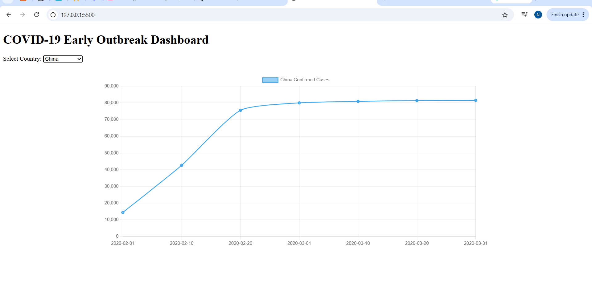
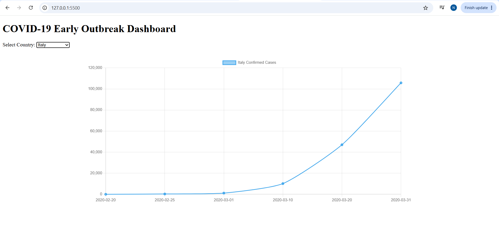

## Milestone 1 — Setup & Data Loading

- [x] Project structure created
- [x] COVID-19 JSON dataset loaded
- [x] Country data extracted using JavaScript
- [x] Country selector populated dynamically
- [x] Data logged to browser console

## Milestone 2 — Charts Implementation

- [x] Chart.js integrated
- [x] Line chart implemented
- [x] Confirmed cases displayed over time
- [x] Chart updates when country changes
- [x] Tested with multiple countries

### Milestone 2 Testing Evidence

The confirmed cases line chart was tested by selecting each
available country from the dropdown. The chart updates to
display the corresponding confirmed case data.

#### China

#### Italy

#### South Korea

#### United States

#### South Africa

