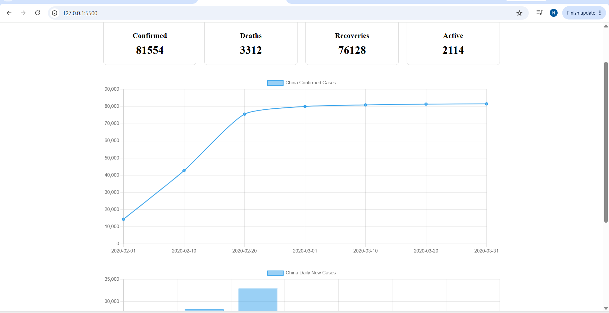
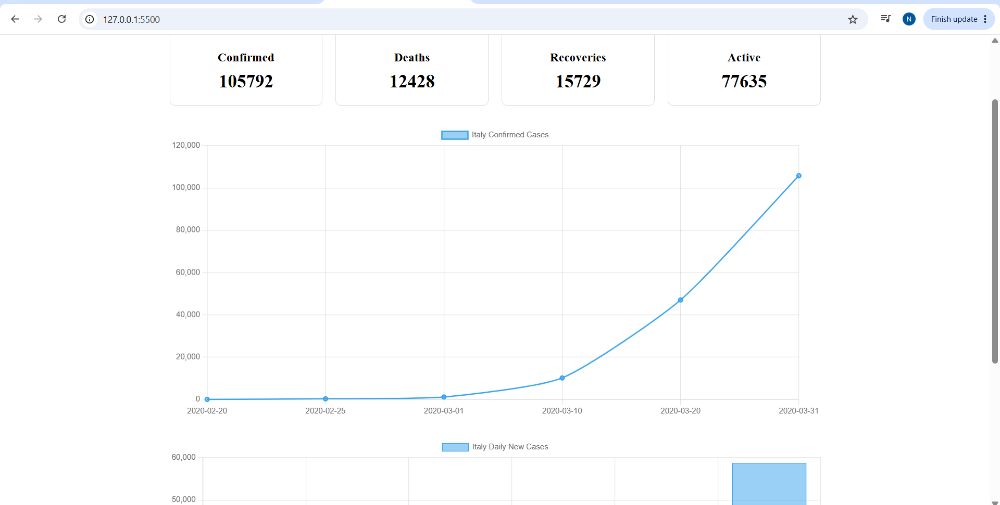

## Milestone 1 — Setup & Data Loading

- [x] Project structure created
- [x] COVID-19 JSON dataset loaded
- [x] Country data extracted using JavaScript
- [x] Country selector populated dynamically
- [x] Data logged to browser console

## Milestone 2 — Charts Implementation

- [x] Chart.js integrated
- [x] Line chart implemented
- [x] Confirmed cases displayed over time
- [x] Chart updates when country changes
- [x] Tested with multiple countries


### Milestone 2 Testing Evidence

The confirmed cases line chart was tested by selecting each
available country from the dropdown. The chart updates to
display the corresponding confirmed case data.

#### China


#### Italy


#### South Korea


#### United States


#### South Africa


## Milestone 3 — All Charts & Metrics

Key metric cards implemented
Latest confirmed cases displayed
Latest deaths displayed
Latest recoveries displayed
Active cases calculated
Daily new cases calculated from cumulative data
Daily new cases bar chart implemented
Metrics and charts update when country changes
Tested with all five countries

### Milestone 3 Testing Evidence

The dashboard was tested using all five available countries.
The metric cards, confirmed cases chart, and daily new cases
chart update according to the selected country's data.

Countries tested:

- China

- Italy

- South Korea

- United States

- South Africa


## Running the Project

### Prerequisites

Visual Studio Code
Live Server extension for VS Code
A modern web browser

### Steps

1. Clone the repository:

```bash
git clone https://github.com/Nqobizitha04Mbuyisa/covid-19-dashboard.git


2. Open the project folder in Visual Studio Code.

3. Make sure the following files are in the project folder:
- index.html
- script.js
- style.css
- covid.json

4. Right-click index.html and select Open with Live Server.

5. The dashboard will open in the browser.

6. Use the Select Country dropdown to explore the COVID-19 data for each country.
